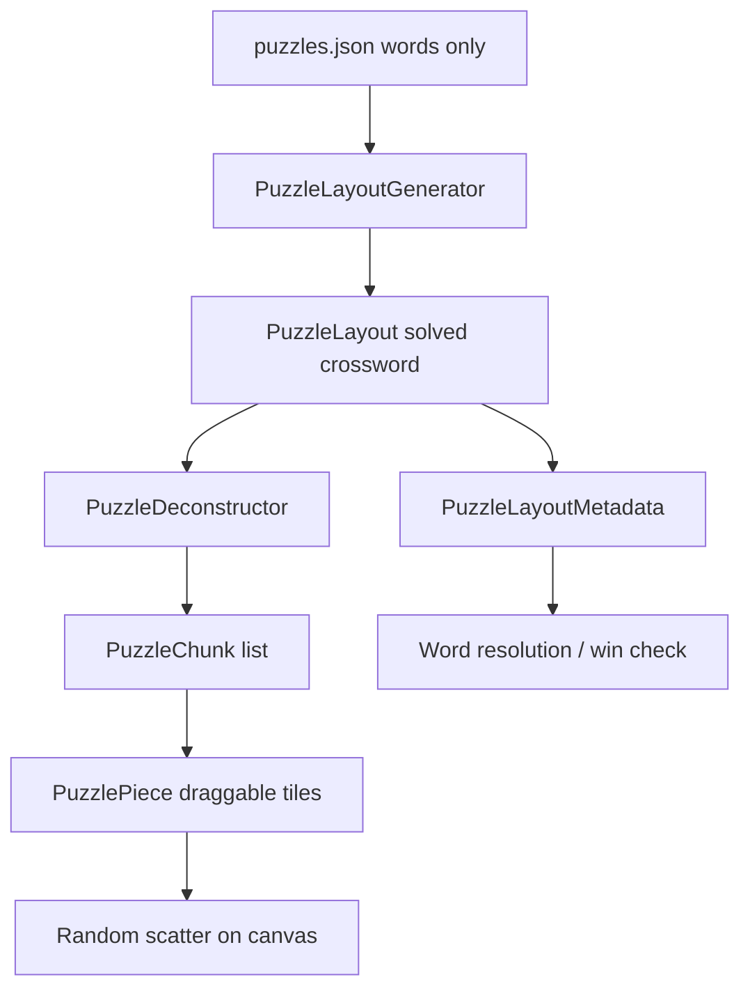

# Puzzle Generation and Deconstruction

This document explains how Jam Pro turns a word list into a playable crossword puzzle: how the **solved grid is generated**, how it is **deconstructed into draggable chunks**, and how the game tracks progress toward the solution.

---

## Overview

The puzzle pipeline has two core stages:

1. **Generation** — build a valid crossword layout from words.
2. **Deconstruction** — break that solved layout into small connected chunks the player drags on screen.

The final grid is **never stored in JSON**. It is computed at runtime from the word list.



| Stage | Input | Output |
|-------|-------|--------|
| Data | `puzzles.json` entry | `PuzzleContent` (id, category, words) |
| Generation | Word list | `PuzzleLayout` (solved crossword) |
| Deconstruction | `PuzzleLayout` | `DeconstructedPuzzle` (chunks) |
| Play setup | Chunks + canvas size | Scattered `PuzzlePiece`s |
| Runtime | Player moves | Word resolution → puzzle complete |

**Key source files:**

- `assets/data/puzzles.json` — puzzle word lists
- `lib/features/puzzle/data/generators/puzzle_layout_generator.dart` — layout generation
- `lib/features/puzzle/data/deconstructors/puzzle_deconstructor.dart` — chunk splitting
- `lib/features/puzzle/presentation/puzzle_screen.dart` — orchestration at load time

---

## Input: What puzzles.json contains

Each puzzle entry stores metadata and words only:

```json
{ "id": 1, "category": "Directions", "words": ["NORTH", "SOUTH", "EAST", "WEST"], "enabled": true }
```

There is no grid, no letter positions, and no chunk definitions. Everything below is derived at runtime.

**Model:** `lib/features/puzzle/data/models/puzzle_content.dart`  
**Loader:** `lib/features/puzzle/data/repositories/puzzle_repository.dart`

---

## Stage 1: Layout Generation

**File:** `lib/features/puzzle/data/generators/puzzle_layout_generator.dart`  
**Entry point:** `PuzzleLayoutGenerator.generateAllLayouts(words)`

The generator builds a **connected crossword** where words intersect on shared letters, similar to a newspaper crossword but generated algorithmically.

### Step 1 — Connectivity pre-check

Before placing any words, the generator checks whether the word set can form a connected crossword at all.

- Each word is a node in a graph.
- Two words are connected if they share at least one letter.
- A BFS from the first word must reach every other word.

If words cannot chain through shared letters (e.g. two groups with no letter overlap), generation returns no layouts.

**Function:** `_canPotentiallyConnect()`

### Step 2 — Seed the first word

- Words are sorted **longest first**, then alphabetically.
- The longest word is placed at `(row: 0, col: 0)` running **horizontally**.

Example: `NORTH` becomes a horizontal word starting at the origin.

### Step 3 — Backtracking placement

For each remaining word, the generator:

1. Finds every letter shared with every already-placed word.
2. Builds **crossing candidates** — positions where the new word crosses an existing word at that shared letter.
3. Tries each candidate; on success, recurses to the next word; on failure, backtracks.

**Crossing rule:**

- If the placed word is **horizontal**, the new word is placed **vertical** through the shared letter.
- If the placed word is **vertical**, the new word is placed **horizontal** through the shared letter.

**Functions:** `_backtrackPlaceWords()`, `_generateCandidates()`, `_buildPlacementFromCrossing()`

### Step 4 — Placement validation rules

A candidate placement is accepted only if all rules pass:

| Rule | What it enforces |
|------|------------------|
| Must cross existing grid | At least one cell overlaps an already-placed letter |
| Letter match on overlap | Shared cells must have the same letter |
| No parallel adjacency | Empty cells beside a horizontal word cannot have letters directly above/below (and vice versa for vertical words) |
| Empty end caps | The cell immediately before the word start and after the word end must be empty |

**Functions:** `_canPlaceWord()`, `_perpendicularNeighborsEmpty()`, `_endCapsEmpty()`

### Step 5 — Normalize and deduplicate

When all words are placed:

- `PuzzleLayout.normalize()` shifts all coordinates so the bounding box starts at `(0, 0)`.
- `PuzzleLayout.signature()` produces a canonical string used to avoid storing duplicate layouts.
- `generateAllLayouts()` may return **multiple unique layouts** for the same word set.

### The PuzzleLayout model

**File:** `lib/features/puzzle/data/models/puzzle_layout.dart`

| Field | Meaning |
|-------|---------|
| `placedWords` | Each word with `(row, col, direction)` |
| `minRow / maxRow / minCol / maxCol` | Bounding box of the crossword |
| `occupiedCells` (getter) | Flat list of `{row, col, letter}` — the **final solved grid** |

`occupiedCells` is built by merging all placed word letters into a single cell map. This is the canonical target grid the player is working toward.

---

## Stage 2: Deconstruction

**File:** `lib/features/puzzle/data/deconstructors/puzzle_deconstructor.dart`  
**Entry point:** `PuzzleDeconstructor.build(layout)`

Generation produces one solved crossword. The player should not receive it whole — the deconstructor **cuts the grid into draggable chunks**.

### Goal

Partition every cell in the solved grid into **connected chunks** of roughly **2–3 cells** (sometimes 1 when necessary), such that:

- Each chunk is orthogonally connected (no disconnected cells within one chunk).
- After removing a chunk, the **remaining cells stay connected** (no orphan islands left behind).

### Algorithm

1. Build a letter map from `layout.occupiedCells` → `Map<BoardCellPosition, String>`.
2. Track `remainingCells` as a set of all grid positions.
3. Repeat until `remainingCells` is empty:
   - **Pick seed** — top-leftmost remaining cell (`_pickSeedCell`).
   - **Pick target size** — 2 or 3 cells (random, but seeded by layout signature for reproducibility).
   - **Grow chunk** — BFS from seed into adjacent remaining cells (`_growChunkCandidate`).
   - **Validate** — `isValidChunkCandidate()` checks connectivity of both the chunk and the remainder.
   - If invalid, try fallback sizes/seeds (`_findValidFallbackChunk`).
   - **Build chunk** — `buildChunkFromCells()` and remove those cells from `remainingCells`.
4. Return `DeconstructedPuzzle(sourceLayout: layout, chunks: [...])`.

### The isValidChunkCandidate rule

This is the most important deconstruction constraint:

- The candidate chunk must be connected.
- The **remainder** (all cells not in this chunk) must also be connected.

This prevents cuts that would split the grid into two disconnected groups, which would make the puzzle unsolvable as separate movable pieces.

**Function:** `isValidChunkCandidate()`

### PuzzleChunk: dual coordinate systems

**File:** `lib/features/puzzle/data/models/puzzle_chunk.dart`

Each chunk stores letters in two coordinate spaces:

| Field | Purpose |
|-------|---------|
| `solvedCells` | Letters at **final layout coordinates** (e.g. row 2, col 3 → `'T'`) |
| `localCells` | Same letters in **chunk-local coordinates** starting at `(0, 0)` |
| `solvedMinRow / solvedMinCol` | Top-left anchor of this chunk in the solved layout |
| `width / height` | Chunk dimensions in cells |

**Why two systems?**

- `solvedCells` tells the game where this chunk belongs in the target grid.
- `localCells` is what the UI uses to render the chunk as a compact draggable tile group.

### Deterministic randomness

Chunk sizes and growth order use `Random(signature.hashCode)` where `signature` is the layout signature. The same layout always produces the same chunk partition.

---

## Stage 3: Playable Pieces

**Files:**

- `lib/features/puzzle/domain/deconstructed_pieces_builder.dart`
- `lib/features/puzzle/domain/piece_spawn_layout.dart`
- `lib/features/puzzle/domain/puzzle_piece.dart`

### Chunks to PuzzlePieces

Each `PuzzleChunk` is converted to a `PuzzlePiece` via `PuzzlePiece.fromChunk()`. A piece has:

| Field | Meaning |
|-------|---------|
| `cells` | Local letter cells with `rowOffset` / `colOffset` |
| `anchorRow / anchorCol` | Current position on the play canvas |
| `spawnAnchorRow / spawnAnchorCol` | Original spawn position (for return-on-invalid-drop) |
| `chunkId` | Link back to the source chunk |

### Random scatter

Pieces are not placed in their solved positions. `computeRandomScatter()` finds non-overlapping random positions across the play canvas.

- Tries random placements per piece (up to 200 attempts each).
- Falls back to exhaustive search, then tray layout if random scatter fails.
- `applySpawnAnchors()` sets each piece's anchor and spawn anchor.

**Functions:** `buildDeconstructedPlayPieces()`, `computeRandomScatter()`, `applySpawnAnchors()`

The player sees **scrambled chunks**, not the solved layout.

---

## Stage 4: Metadata and Win Detection

**Files:**

- `lib/features/puzzle/domain/word_resolution/puzzle_layout_metadata.dart`
- `lib/features/puzzle/domain/word_resolution/word_resolution_service.dart`
- `lib/features/puzzle/domain/word_resolution/puzzle_runtime_state.dart`

While the player drags tiles, the game does not simply diff raw grids. It uses a **reference graph** built from the layout and deconstruction.

### PuzzleLayoutMetadata

Built by `PuzzleLayoutMetadata.fromLayoutAndDeconstruction(layout, deconstructed)`.

| Map | Contents |
|-----|----------|
| `finalCellById` | Every solved cell as `final_{row}_{col}` with letter and word memberships |
| `wordById` | Target words, their cell IDs, and orientation (horizontal/vertical) |
| `wordCellIndexMap` | Letter index within each word for each final cell |
| `chunkById` | Links each chunk to its final cell IDs |
| `wordToChunkCoverage` | Which chunks contribute to which words |
| `targetWordIds` | All words that must be solved |

### Final cell IDs

Each cell in the solved layout gets a stable ID:

```
final_{row}_{col}
```

Example: `final_2_3` is the cell at row 2, column 3 in the normalized layout.

**Function:** `finalCellIdForLayout(row, col)` in `word_resolution_models.dart`

### Runtime mapping

As pieces move on the canvas, `puzzle_runtime_state.dart` maps current board positions back to final cell IDs using a coordinate delta inferred from placed chunks. This bridges:

- **Canvas coordinates** — where pieces are on the large play board.
- **Layout coordinates** — where cells belong in the solved grid.

### Win condition

A puzzle is complete when **every target word is resolved**:

```
metadata.targetWordIds.every(solvedWordIds.contains)
```

**Function:** `checkAndHandlePuzzleCompleted()` in `word_resolution_service.dart`

Win is **word-based**, not a single pixel-perfect grid comparison. Words are detected as the player connects and aligns chunks correctly.

---

## End-to-End Load Sequence

When a puzzle opens, `PuzzleScreen` orchestrates the full pipeline:

```
1. PuzzleRepository.getPuzzleById(puzzleId)
      → PuzzleContent from puzzles.json

2. PuzzleLayoutGenerator().generateAllLayouts(puzzle.words)
      → List<PuzzleLayout> (one or more valid crosswords)

3. PuzzleScreen picks current layout (index 0 by default)

4. On canvas size known, PuzzleScreen._rebuildPlayPieces():
      a. PuzzleDeconstructor().build(layout)
            → DeconstructedPuzzle
      b. PuzzleLayoutMetadata.fromLayoutAndDeconstruction(layout, deconstructed)
            → PuzzleLayoutMetadata
      c. buildDeconstructedPlayPieces(layout, canvasRows, canvasCols)
            → List<PuzzlePiece> scattered on canvas

5. Player drags pieces → word resolution runs on each move

6. All targetWordIds solved → puzzle complete
```

**Orchestration file:** `lib/features/puzzle/presentation/puzzle_screen.dart`  
**Key methods:** `_loadAndGenerate()`, `_schedulePlayCanvasUpdate()`, `_rebuildPlayPieces()`

---

## Worked Example: Directions Puzzle

**Input words:** `NORTH`, `SOUTH`, `EAST`, `WEST`

### Generation (conceptual)

The generator might produce a crossword like:

```
    N O R T H
        |
        O
        |
    S O U T H
```

Words cross on shared letters (`O`, `T`, `H`, etc.). `EAST` and `WEST` would be placed through further backtracking crossings. The exact shape depends on which candidates succeed.

The result is a `PuzzleLayout` with normalized coordinates and an `occupiedCells` list representing every letter position.

### Deconstruction (conceptual)

The deconstructor might split the grid into chunks such as:

| Chunk | Cells | Letters |
|-------|-------|---------|
| chunk_0 | 3 cells | `N O R` |
| chunk_1 | 2 cells | `T H` |
| chunk_2 | 3 cells | `S O U` |
| chunk_3 | 2 cells | `T H` |
| ... | ... | ... |

Each chunk is 1–3 orthogonally connected cells. The exact partition is deterministic per layout signature.

### Play

- Chunks become `PuzzlePiece`s.
- Pieces are scattered across the bottom and middle of the green play canvas.
- The player drags and connects them until all four words form correctly.
- The **FULL GRID** hint button shows `occupiedCells` as a reference popup.

---

## Key File Index

| Concept | File |
|---------|------|
| Puzzle JSON data | `assets/data/puzzles.json` |
| Puzzle content model | `lib/features/puzzle/data/models/puzzle_content.dart` |
| Layout generator | `lib/features/puzzle/data/generators/puzzle_layout_generator.dart` |
| Placed word model | `lib/features/puzzle/data/models/placed_word.dart` |
| Layout model + occupied cells | `lib/features/puzzle/data/models/puzzle_layout.dart` |
| Grid cell model | `lib/features/puzzle/data/models/grid_cell.dart` |
| Deconstructor | `lib/features/puzzle/data/deconstructors/puzzle_deconstructor.dart` |
| Chunk model | `lib/features/puzzle/data/models/puzzle_chunk.dart` |
| Deconstructed puzzle wrapper | `lib/features/puzzle/data/models/deconstructed_puzzle.dart` |
| Pieces builder | `lib/features/puzzle/domain/deconstructed_pieces_builder.dart` |
| Spawn / scatter layout | `lib/features/puzzle/domain/piece_spawn_layout.dart` |
| Draggable piece model | `lib/features/puzzle/domain/puzzle_piece.dart` |
| Layout metadata | `lib/features/puzzle/domain/word_resolution/puzzle_layout_metadata.dart` |
| Word resolution | `lib/features/puzzle/domain/word_resolution/word_resolution_service.dart` |
| Runtime state mapping | `lib/features/puzzle/domain/word_resolution/puzzle_runtime_state.dart` |
| Board helpers | `lib/features/puzzle/domain/puzzle_board_state.dart` |
| Solved grid checker (debug/tests) | `lib/features/puzzle/domain/puzzle_solved_checker.dart` |
| Screen orchestration | `lib/features/puzzle/presentation/puzzle_screen.dart` |
| Final grid hint popup | `lib/features/puzzle/presentation/hints/final_grid_hint_popup.dart` |
| Generator tests | `test/puzzle_deconstructor_test.dart` |
| Deconstructor tests | `test/puzzle_deconstructor_test.dart` |
| Board state tests | `test/puzzle_board_state_test.dart` |

---

## Core Mechanisms Summary

| Mechanism | One-line description |
|-----------|---------------------|
| **Generation** | Backtracking crossword solver: cross words on shared letters with strict placement rules. |
| **Layout** | Canonical solved grid stored as placed words + derived `occupiedCells`. |
| **Deconstruction** | Partition the grid into 2–3 cell connected chunks without splitting the remainder. |
| **Pieces** | Chunks converted to draggable `PuzzlePiece`s and scattered on the canvas. |
| **Metadata** | Reference graph linking chunks, final cells, and target words. |
| **Win** | All `targetWordIds` appear in `solvedWordIds` via word resolution. |

---

## Related Reading

- **Hint system (connect hints):** `lib/features/puzzle/domain/puzzle_hint_service.dart`
- **Move history / undo:** `lib/features/puzzle/domain/puzzle_move_history.dart`
- **Drop evaluation (snap vs return):** `lib/features/puzzle/domain/chunk_drop_evaluator.dart`
