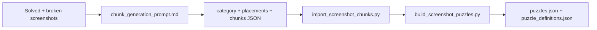

# Screenshot puzzle authoring

## How to use in Cursor

1. Copy the **Generation prompt** below into a new Cursor chat.
2. Replace `{{CATEGORY_NAME}}` and `{{WORDS_ARRAY}}` with your puzzle category and word list.
3. Attach two screenshots:
   - **Final solved grid** (crossword complete)
   - **Broken scattered puzzle** (chunk boundaries visible)
4. Ask Cursor to return **only** the JSON object (chunks + placements for repo import).
5. Save the result to a file (e.g. `tool/examples/my_puzzle.json`).
6. Validate and get a paste-ready `PUZZLES` entry:

```bash
python3 tool/import_screenshot_chunks.py tool/examples/my_puzzle.json
```

7. Paste the printed entry into `PUZZLES` in `tool/build_screenshot_puzzles.py`, then rebuild assets:

```bash
python3 tool/build_screenshot_puzzles.py
flutter test test/puzzle_definition_validator_test.dart
```



---

## Generation prompt

I am giving you one Bonza-style puzzle.
Your job is to generate the chunk JSON for this puzzle in the same format as our existing manually-authored content.

### Goal

From the provided puzzle data, generate the chunks JSON where:

- each chunk represents one broken piece shown in the scattered puzzle screenshot
- each chunk is expressed using coordinates from the final solved grid
- each cell is represented as: `(row, col, "LETTER")`

### Input I am providing

**Category**

{{CATEGORY_NAME}}

**Words**

{{WORDS_ARRAY}}

**Final solved grid screenshot**

I will provide the screenshot where the final solved crossword/grid is visible.

**Broken puzzle screenshot**

I will provide the screenshot where the puzzle is broken into scattered chunks.

### Output format required

Return only a JSON object in this format:

```json
{
  "category": "{{CATEGORY_NAME}}",
  "placements": [
    { "word": "WORD", "row": 0, "col": 0, "direction": "horizontal" }
  ],
  "chunks": [
    [[row, col, "L"], [row, col, "L"]],
    [[row, col, "L"], [row, col, "L"]]
  ]
}
```

For repo import, also include `puzzleId`, `words`, and `enabled` when saving to a file:

```json
{
  "puzzleId": 7,
  "category": "{{CATEGORY_NAME}}",
  "words": ["WORD1", "WORD2"],
  "enabled": true,
  "placements": [...],
  "chunks": [...]
}
```

### Coordinate rules

Use the final solved grid as the source of coordinates.

- `(0,0)` = top-left cell of the final solved puzzle bounding box
- row increases downward
- column increases rightward
- every tile cell in every chunk must be mapped to the final solved grid position

Example cell: `[2, 3, "P"]` means row = 2, col = 3, letter = P.

### Very important chunking rule

Chunks must be formed according to the **broken puzzle screenshot**, not according to the words directly.

That means:

- if a scattered piece in the broken puzzle contains 4 connected tiles, then that should become one chunk
- if a word is split across multiple scattered pieces, then it must remain split into those multiple chunks
- if a chunk contains letters from intersecting words, keep them together exactly as shown in the broken puzzle screenshot

### Required process

Follow these steps internally before producing the final JSON:

**Step 1 — Reconstruct the final solved grid**

Using the solved screenshot and the given words:

- identify the final crossword layout
- identify row/col of every letter cell
- build the final solved bounding box
- output `placements` for each word

**Step 2 — Identify each scattered chunk**

From the broken puzzle screenshot:

- detect each separate visible piece
- for each piece, determine which final solved cells belong to it

**Step 3 — Build chunk arrays**

For each chunk:

- list all its cells as `[row, col, "LETTER"]`
- preserve all letters exactly

**Step 4 — Validate**

Before returning the answer, verify:

- every final solved cell is covered by exactly one chunk
- no cell is duplicated across chunks
- chunk letters exactly match the solved grid letters
- chunks match the broken screenshot pieces, not arbitrary word splits

### Important constraints

- Do not invent a different final layout — the layout must match the solved screenshot.
- Do not split chunks differently from the broken screenshot — chunk boundaries must match the visible broken pieces.
- Do not return explanations — return only the final JSON object.
- Do not add extra fields beyond category, placements, and chunks (plus puzzleId/words/enabled when saving for import).

### Example of the style we use

```json
{
  "category": "Planets",
  "placements": [
    { "word": "VENUS", "row": 0, "col": 0, "direction": "horizontal" },
    { "word": "JUPITER", "row": 2, "col": 0, "direction": "horizontal" },
    { "word": "NEPTUNE", "row": 0, "col": 2, "direction": "vertical" },
    { "word": "SATURN", "row": 0, "col": 4, "direction": "vertical" },
    { "word": "MARS", "row": 0, "col": 6, "direction": "vertical" }
  ],
  "chunks": [
    [[0,0,"V"], [0,1,"E"], [0,2,"N"], [1,2,"E"]],
    [[0,3,"U"], [0,4,"S"], [1,4,"A"]],
    [[0,6,"M"], [1,6,"A"]],
    [[2,0,"J"], [2,1,"U"], [2,2,"P"], [2,3,"I"], [3,2,"T"]],
    [[2,4,"T"], [2,5,"E"], [2,6,"R"], [3,6,"S"]],
    [[4,2,"U"], [5,2,"N"], [6,2,"E"]],
    [[3,4,"U"], [4,4,"R"], [5,4,"N"]]
  ]
}
```

Use this format only, but generate the data for my current puzzle from the screenshots I provide.

### Example level (Can Be Broken)

- **Category:** Can Be Broken
- **Words:** `["HEART", "RECORD", "PROMISE", "WINDOW", "RULE"]`
- Attach: broken puzzle screenshot + final solved screenshot
